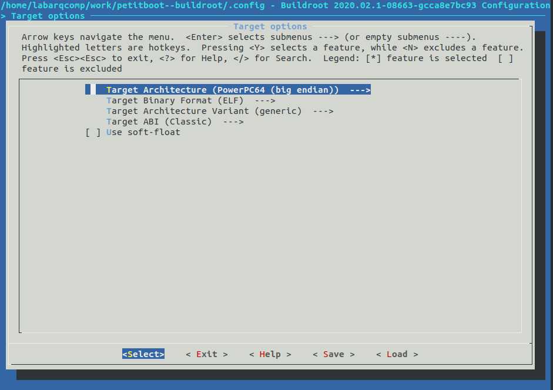

# PS3 Hack

- **Alunes:** Gabriel Monteiro / Guilherme Leite / Hugo Carl
- **Curso:** Engenharia da Computação
- **Semestre:** 9
- **Contato:** corsiferrao@gmail.com, guilhermepl3@al.insper.edu.br
- **Ano:** 2020

## Starting

To follow this tutorial you will need:

- **Hardware:** PS3 Fat, USB Flash Drive
- **Software:** A Linux distribution, we will be using Ubuntu

## Motivation

Many people tend to buy new gaming consoles in their launch, meanig a large number of obsolete consoles are left unused the objective of this tutorial is to repurpose these old pieces of hardware by installing GNU/Linux enabliing them to be used for a vast number of applications.

----------------------------------------------

## Linux on the PS3
contar da historia de que anstes dava pra instalar e tal


## Setting Up the PS3 and Booting from a Live Image
falar basicamente do tutorial do cara

###

###


## Using buildroot for Cross-Compilation

Buildroot is a set of Makefiles and patches that simplifies and automates the process of building a complete and bootable Linux environment for an embedded system, while using cross-compilation to allow building for multiple target platforms on a single Linux-based development system. Buildroot can automatically build the required cross-compilation toolchain, create a root file system, compile a Linux kernel image, and generate a boot loader for the targeted embedded system, or it can perform any independent combination of these steps. For example, an already installed cross-compilation toolchain can be used independently, while Buildroot only creates the root file system.

This means we can create compile a Linux enviroment that will run on the PS3 from our Desktop, this is great because now we don't need to rely on whatever packages, applications and configurations the pre-compiled distribution comes with.


We will be using the [petitboot--buildroot](https://github.com/glevand/petitboot--buildroot) project wich is basically buildroot with updates to generate a bootable *petitboot* image. This is because the bootloader, wich is a progtam that loads the operating system into the working memory of a computer on start-up, is called petitboot and is not availabe on the original buildroot

    $ git clone https://github.com/glevand/petitboot--buildroot.git
    $ cd petitboot--buildroot

Now we can configure what we want the buildroot to include in our own linux

    $ make menuconfig

This command should bring up an interface like the one shown below that can be navigated using the arrow keys, Enter and Esc:


Under Target options we need to change the __Target Architecture__ to the one of the PS3, wich is big endian PowerPC64



After that you can press the Escape key twice to go back to the main menu and then enter the __Kernel__ submenu. There we can select our kernel's verion or specify one to be downloaded. We will also set the Defconfig name as PS3 under the Kernel Configuration option, this will automatically set some configurations specific to the PS3. Also change the Kernel binary format to __vmlinux__ and enable the __Install kernel image to /boot in target__  option.


You can also change options under __System Configurations__ and __Target packages__ to personalize your linux and also compile it with some additional programs such as Python or even some emulators.

Finally we can compile it, fot that we will use the commands bellow, the `clean` argument is important if you've alredy tried to compile the os before since it will delete the files generated from previous attempts. The `-j 8` argument means the compiller will use 8 threads from the CPU to compile everything, you can change that value depending on your hardware, the more threads you give the compiller the faster the processing will be.

    $ make clean
    $ make all -j 8

The compiled Filesystem and kernel will be in `/output/images/`


----------------------------------------------

## Recursos Markdown

Vocês podem usar tudo que já sabem de markdown mais alguns recursos:

!!! note 
    Bloco de destaque de texto, pode ser:
    
    - note, example, warning, info, tip, danger
    
!!! example "Faça assim"
    É possível editar o título desses blocos
    
    !!! warning
        Isso também é possível de ser feito, mas
        use com parcimonia.
    
??? info 
    Também da para esconder o texto, usar para coisas
    muito grandes, ou exemplos de códigos.
    
    ```txt
    ...
    
    
    
    
    
    
    
    
    
    
    
    oi!
    ```
    
- **Esse é um texto em destaque**
- ==Pode fazer isso também==

Usar emojis da lista:

:two_hearts: - https://github.com/caiyongji/emoji-list


```c
// da para colocar códigos
 void main (void) {}
```

É legal usar abas para coisas desse tipo:
    
=== "C"

    ``` c
    #include <stdio.h>

    int main(void) {
      printf("Hello world!\n");
      return 0;
    }
    ```

=== "C++"

    ``` c++
    #include <iostream>

    int main(void) {
      std::cout << "Hello world!" << std::endl;
      return 0;
    }
    ```

Inserir vídeo:

-  Abra o youtube :arrow_right: clique com botão direito no vídeo :arrow_right: copia código de incorporação:

<iframe width="630" height="450" src="https://www.youtube.com/embed/UIGsSLCoIhM" frameborder="0" allow="accelerometer; autoplay; clipboard-write; encrypted-media; gyroscope; picture-in-picture" allowfullscreen></iframe>

!!! tip
    Eu ajusto o tamanho do vídeo `width`/`height` para não ficar gigante na página
    
Imagens você insere como em plain markdown, mas tem a vantagem de poder mudar as dimensões com o marcador `{width=...}`
    


{width=200}
